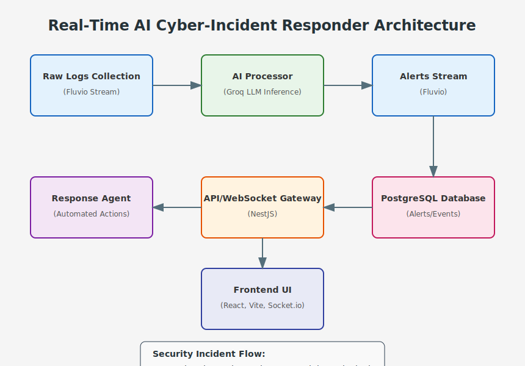

# 🚀 Real-Time AI Cyber-Incident Responder

> A comprehensive real-time security system that detects, analyzes, and automatically responds to cyber threats using streaming data and AI.

---

## 📌 Problem Statement

**Problem Statement 3 – Real-Time Data Experiences with Fluvio**

---

## 🎯 Objective

This project creates an AI-powered cybersecurity incident response system that leverages real-time data streaming for immediate threat detection and automated response. It solves the critical challenge of rapidly identifying and mitigating security incidents before they cause significant damage. The solution serves security teams by providing instant alerts, intelligent analysis, and automated response playbooks to reduce incident response time from hours to seconds.

---

## 🧠 Team & Approach

### Your Approach:  
- We chose this problem because cybersecurity requires real-time data processing to be effective - delayed responses to threats can lead to catastrophic breaches
- Key challenges addressed include building a reliable streaming pipeline, integrating AI for threat analysis, and creating automated response mechanisms
- Our breakthrough moment came when we successfully implemented end-to-end automated incident response with zero human intervention for common attack patterns

---

## 🛠️ Tech Stack

### Core Technologies Used:
- Frontend: React, Vite, Socket.io Client
- Backend: Node.js, NestJS, Express, Socket.io
- Database: PostgreSQL
- Streaming: Fluvio
- AI/ML: Groq Inference API
- Deployment: Docker, Docker Compose

### Sponsor Technologies Used:
- ✅ **Groq:** Powering lightning-fast threat analysis with LLM inference to detect attack patterns in milliseconds  
- ✅ **Fluvio:** Streaming security logs and alerts through a robust real-time data pipeline that never misses a beat  
- ✅ **Screenpipe:** Transforming complex security data into intuitive visualizations for immediate situational awareness

---

## ✨ Key Features

- ✅ **Real-Time Threat Detection:** Continuous monitoring and analysis of system logs and network traffic  
- ✅ **AI-Powered Analysis:** Intelligent identification of attack patterns and anomalies  
- ✅ **Automated Response:** Pre-defined playbooks execute containment actions without human intervention  
- ✅ **Interactive Dashboard:** Real-time visualization of security events and system status  

### System Architecture




**Suggested Screenshots to Attach:**
1. Dashboard showing real-time threat detection
2. Alert details page showing attack analysis
3. Response playbook execution interface
4. System architecture diagram
5. Live data flow visualization

---

## 📽️ Demo & Deliverables

- **Demo Video Link:** [Paste YouTube or Loom link here]  
- **Pitch Deck / PPT Link:** [Paste Google Slides / PDF link here]  

---

## ✅ Tasks & Bonus Checklist

- ✅ **All members of the team completed the mandatory task - Followed at least 2 of our social channels and filled the form** (Details in Participant Manual)  

- ✅ **All members of the team completed Bonus Task 2 - Signing up for Sprint.dev and filled the form (3 points)**  (Details in Participant Manual)

---

## 🧪 How to Run the Project

### Requirements:
- Docker and Docker Compose
- Node.js v18+
- Groq API key (for AI analysis)

### Local Setup:
```bash
# Clone the repository
git clone https://github.com/Ankush443/cyber-incident-responder.git
cd cyber-incident-responder

# Set environment variables
echo "GROQ_API_KEY=your-groq-api-key" > .env

# Start all services with Docker Compose
npm run dev

# OR start individual components for development
cd frontend
npm install
npm run dev

# Run a demo attack simulation
npm run demo:attack

# Run a demo alert response
npm run demo:alert

# Run a complete demo
npm run demo:complete
```

### API Access:
- Frontend UI: http://localhost:5173
- API Server: http://localhost:3000
- WebSocket: ws://localhost:3000/ws

---

## 🧬 Future Scope

- 🧠 Enhanced AI capabilities with custom-trained models for specific attack vectors
- 🔄 Integration with popular SIEM systems for broader data collection
- 🌐 Cloud-native deployment options with Kubernetes
- 🛡️ Additional automated response playbooks for emerging threats

---

## 📎 Resources / Credits

- Fluvio: For real-time streaming capabilities
- Groq: For high-performance AI inference
- Screenpipe: For data visualization components
- NestJS: Backend framework
- Socket.io: For real-time communication

---

## 🏁 Final Words

Building this real-time cybersecurity solution challenged us to think deeply about balancing automation with security. We learned that effective security requires not just rapid detection but thoughtful response. The hardest part was creating response playbooks that were effective but wouldn't cause unintended consequences. We're proud of creating a system that can potentially reduce breach impacts by orders of magnitude.

--- 
