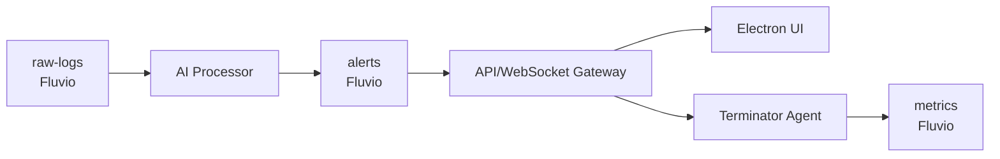

# AI Incident Responder



## Quick Start

```bash
export GROQ_API_KEY=your_key_here
npm install
npm run dev
```

- Opens Electron UI
- Streams logs into `raw-logs` via `services/stream-ingest`
- AI Processor produces `alerts`
- Agent executes commands, emits `metrics`

## Threat Model

- **Log Forgery:** validate source of logs
- **PKI:** mTLS for agent ↔ API
- **JWT:** short-lived tokens for UI & CLI
- **Command Signing:** Ed25519 with daily key rotation

## Adding Playbooks

1. Define steps in `services/api-server/prisma/schema.prisma` and migrate.
2. Create new records in `playbook` table via REST.
3. Trigger via WS or REST `/playbooks/execute`. 