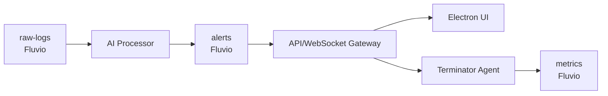

# AI Incident Responder



## Quick Start

### Prerequisites

- Node.js 16+ and npm
- Docker and Docker Compose
- Rust toolchain (for agent development)
- GROQ API key (for AI processing)

### Installation

```bash
# Clone the repository
git clone https://github.com/ankush443/ai-incident-responder.git
cd ai-incident-responder

# Set up environment variables
export GROQ_API_KEY=your_key_here

# Install dependencies
npm install

# Start all services with Docker Compose
npm run dev
```

This will:
- Launch all required services in Docker containers
- Open the Electron UI
- Set up Fluvio topics (`raw-logs`, `alerts`, `metrics`)
- Start the AI processor service
- Configure and launch the agent

## Running Demos

Several demo scripts are available to showcase the system's capabilities. You can use either the direct node command or the convenient npm shortcuts:

### Complete Demo

The complete demo provides a comprehensive walkthrough of the system's capabilities, including the AI analysis pipeline and interactive incident response.

```bash
# Using npm shortcut
npm run demo:complete

# Or directly
node screenpipe-demo.js
```

### Attack Simulation

Simulates a multi-stage attack scenario with interactive response options.

```bash
# Using npm shortcut
npm run demo:attack

# Or directly
node demo-attack.js
```

### Basic Alert Demo

Sends a test alert to the WebSocket server to demonstrate the alert flow.

```bash
# Using npm shortcut
npm run demo:alert

# Or directly
node send-alert.js
```

### Frontend Alert Simulation

Simulates alerts being received by the frontend.

```bash
# Using npm shortcut
npm run demo:frontend

# Or directly
node simulate-frontend-alert.js
```

### Quick Demo Execution

To start the standard demo using a shell script:

```bash
npm start
```

## System Components

### Stream Ingest (services/stream-ingest)
Collects logs from various sources and forwards them to the `raw-logs` Fluvio topic.

### AI Processor (services/ai-processor)
Processes raw logs using LLMs to identify potential security threats and generates alerts.

### API Server (services/api-server)
- NestJS-based service that provides WebSocket connections and REST endpoints
- Consumes alerts from Fluvio and broadcasts to connected clients
- Handles action execution requests from the frontend

### Terminator Agent (agent)
- Rust-based service that executes response actions on target systems
- Connects to the API server via WebSocket
- Verifies command signatures before execution
- Reports action results back to the system

### Frontend UI (frontend)
- Electron-based desktop application
- Real-time dashboard of security alerts and logs
- Interface for selecting and executing response actions

## Threat Model

- **Log Forgery:** validate source of logs
- **PKI:** mTLS for agent ↔ API
- **JWT:** short-lived tokens for UI & CLI
- **Command Signing:** Ed25519 with daily key rotation

## Adding Playbooks

1. Define steps in `services/api-server/prisma/schema.prisma` and migrate.
2. Create new records in `playbook` table via REST.
3. Trigger via WS or REST `/playbooks/execute`. 

## Troubleshooting

### Common Issues

1. **WebSocket Connection Failures**: 
   - Check that the API server is running (`docker ps`)
   - Verify network settings in docker-compose.yml

2. **Missing Alerts**:
   - Ensure Fluvio topics are created correctly
   - Check AI processor logs for errors

3. **Agent Execution Failures**:
   - Verify mTLS certificates are configured correctly
   - Check agent logs for signature verification issues

### Logs

All service logs can be viewed with:

```bash
docker-compose logs -f [service-name]
```

## Contributing

See [CONTRIBUTING.md](../CONTRIBUTING.md) for guidelines on contributing to this project.

## Development Environment

For local development outside of Docker:

```bash
# Start only Fluvio in Docker
docker-compose up fluvio

# Run services locally
cd services/api-server && npm run start:dev
cd services/ai-processor && npm run start:dev
cd frontend && npm run dev
``` 